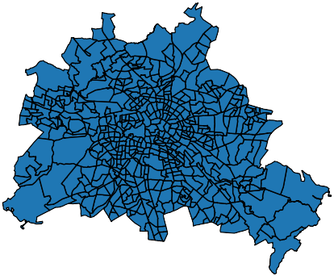
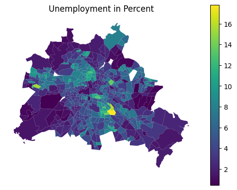
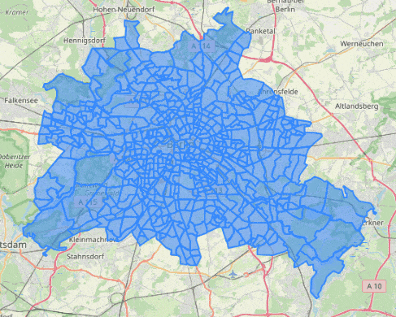

# Berlin PLR Data
Hassle free access to Berlin data, ready to go csv tabular datasets (geometry available for those who want to plot maps). Get deep insights into socio-economic and related data about Berlin's neighborhoods based on actual numbers. Maybe, you're a Berlin resident yourself and you want to explore your surroundings from a data driven perspective? This is where you will find the right datasets and tools!  
This repository contains various preprocessed datasets related to Berlin, with a specific focus on the city's PLRs (Planungsräume = planning spaces).
As of 2021, Berlin monitors social and demographic changes by dividing the city into 542 of said spaces.
Each space is called a Planungsraum (PLR) and features a mean resident count of approximately 7,000. The following figure shows Berlin with its 542 PLRs (interactive map [here](https://nbviewer.org/github/tesch-ch/berlin_PLR_data/blob/main/auxiliary/plr_visu.ipynb)):  

  

--> Each row in the preprocessed datasets corresponds to one of these PLRs. The columns correspond to per PLR features, such as unemployment rate, energy consumption, number of schools, etc...  
--> PLRs are the finest granular spaces of a hierarchical system that is called LOR (lebensweltlich orientierte Räume = lifeworld oriented spaces) which is in detail described [here](https://www.berlin.de/sen/sbw/stadtdaten/stadtwissen/sozialraumorientierte-planungsgrundlagen/lebensweltlich-orientierte-raeume/).  
--> PLRs (LOR in general) are in use since before 2021, but beware, the system was reorganized in 2021. So, pre 2021 PLR datasets have a different total PLR count (447) and different geometry per PLR. This is nothing you have to worry about with the datasets you'll find here. 

**Attention:** Each PLR has its unique ID (column `PLR_ID` in all the datasets). Also, each PLR has a name (column `PLR_NAME` in the datasets), and within the names there is a duplicate ("Schloßstraße"). This is not a mistake, there simply are two different PLRs with the same name. So, do not merge datasets based on `PLR_NAME`, always **merge on `PLR_ID` when combining datasets**!

## Datasets

- Addresses / Adressen: All addresses in Berlin with their respective PLR (no PLR granularity). Can be used for finding an address' PLR.
- Pharmacy Locations / Apothekenstandorte: All pharmacies in Berlin per PLR
- Land ownership / Eigentumskonzentration: Who (natural persons, cooperatives, ...) owns land, not who owns apartments per PLR.
- Charging stations / Elektro-Ladesäulen: Number of electrical charging stations and max power output per PLR.
- Energy consumption / Energieverbrauch: Electrical, district heating, and gas power consumption. Two datasets: per block and per PLR
- Youth centers / Jugendfreizeiteinrichtungen: Youth centers per PLR, count, names, carriers
- Day nurseries / Kitas: Daycare facilities per PLR. Two datasets: simple and verbose
- Violent delinquencies / Monitoring Gewaltdelinquenz: overall violence, youth violence, domestic and partnership per PLR. Two datasets, simplified and regular.
- Social urban development / Monitoring soziale Stadtentwicklung: 3 datasets on social urban development per PLR. Definitely checkout the dataset's [readme](data/monitoring_soziale_stadtentwicklung_2021/README.md), or get directly started using `mss_2021_easy.csv` which is somewhat self explanatory.
- Care facilities / Pflegeeinrichtungen: Care facilities per PLR, contains names, carriers etc...
- PLR: geojson (read with geopandas), containing PLRs with their respective geometry. Used e.g. for plotting heatmaps.
- Schools / Schulen: Schools per PLR, contains names, types, carriers etc...

**Checkout the [rendered demo](https://nbviewer.org/github/tesch-ch/berlin_PLR_data/blob/main/demo.ipynb) with its interactive maps, to get a feel for some of the data available.**

## Fundamentals and Getting Started
- Datasets are already preprocessed and ready to go.
- Datasets are easy to use, follow a clear structure, and aren't particularly big (542 rows -> number of PLRs).
- The preprocessed (csv-)files do not contain geometry data -> no need for fancy libraries (non programmer friendly).
- Basic structure of the datasets (**read in `PLR_ID` as string, so you don't lose the leading zeros**):  
  `df = pd.read_csv(".../mss_2021_easy.csv", dtype={"PLR_ID": str})`
    | PLR_NAME          |   PLR_ID |   Resident Count |   Unemployment Percent |   Social Benefits Receivers Percent |... |
    |:------------------|---------:|-----------------:|-----------------------:|------------------------------------:|---:|
    | Stülerstraße      | 01100101 |             3419 |                4.22 |                             8.04 |... |
    | Großer Tiergarten | 01100102 |             1791 |                1.15 |                             3.46 |... |
    | Lützowstraße      | 01100103 |             5211 |                5.31 |                            15.52 |... |
    | ...     | ... |             ... |                ...  |                             ... |... |
- Each dataset features `PLR_ID` column with unique values. This column can be used as a key for merging multiple datasets if needed (do not merge on `PLR_NAME` because of the duplicate "Schloßstraße").
- If you want to plot maps, read in e.g. `data/plr/plr_only.geojson` as GeoPandas dataframe. This datasets contains the geometry of each PLR. Merge with your "regular" Pandas dataframe on `PLR_ID`.  
  --> now you have the respective PLR geometry attached to each row.
- Also, you can **checkout Leon Ostermann's [Geodata Berlin](https://github.com/Lucky-0ne/geodata_berlin) repository**, it's a small Python package, which simplifies handling Berlin geometry and spatial datasets a lot (and so much more).

These basic principles are illustrated in the [example_simple](example_simple.ipynb) Jupyter notebook (view online [here](https://nbviewer.org/github/tesch-ch/berlin_PLR_data/blob/main/example_simple.ipynb) with working interactive maps).
There we merge datasets, create a heatmap and an interactive map, showcasing multiple features. All of this with just very few lines of code:  

    
    

## Obtain More Datasets
### Where can I find these?
The raw datasets were obtained from [daten.berlin.de](https://daten.berlin.de/) or [FIS-Broker](https://fbinter.stadt-berlin.de/fb/) respectively.  
On daten.berlin.de, you can find countless datasets about Berlin. In the search engine, try "LOR" or "PLR" if you want to find data associated with the LOR-system.
On FIS-Broker, the link above takes you directly to an overview of all the spatial datasets in that app.

### How To Download Spatial Datasets
If there is some sort of geometry associated to your data, you will not find a direct download link to an xlsx or csv file on [daten.berlin.de](https://daten.berlin.de/) or [FIS-Broker](https://fbinter.stadt-berlin.de/fb/). What you will get is a link to a WFS endpoint.  
Spatial data is available via this WFS API and there is no direct/simple way of accessing it. So, you can use the free software [QGIS](https://www.qgis.org/en/site/) to establish a connection to the WFS endpoint and subsequently export what you will find here as raw data. This is in detail described [here](https://lab.technologiestiftung-berlin.de/projects/fisbroker-to-qgis/en/).

Unlike in the tutorial, sometimes you won't find the exact link to the WFS endpoint. So, just copy the WFS endpoint part of the link. Example:  
From `https://fbinter.stadt-berlin.de/fb/wfs/data/senstadt/s_wfs_adressenberlin?REQUEST=GetCapabilities&SERVICE=wfs` simply copy `https://fbinter.stadt-berlin.de/fb/wfs/data/senstadt/s_wfs_adressenberlin` as WFS connection URL to QGIS.

--> [Here](auxiliary/qgis_wfs_connections) you can find an xml export of all the WFS connection URLs to the raw datasets. This xml file can be directly imported by QGIS.
