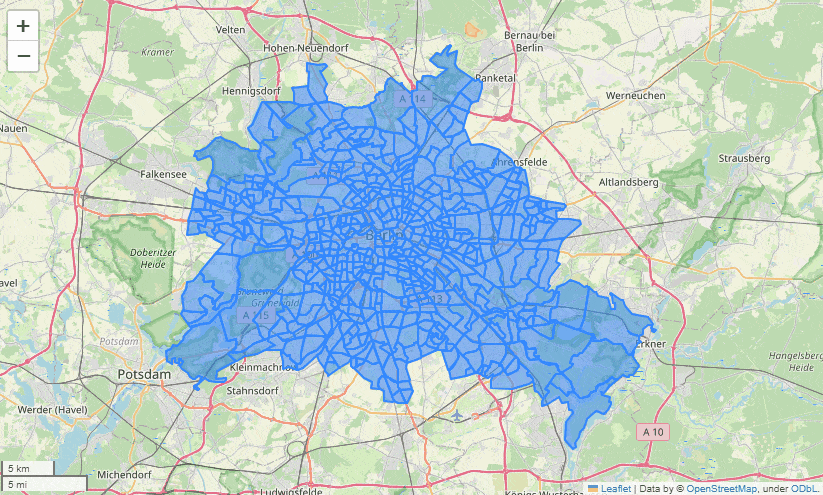

# berlin_PLR_data
Hassle free, ready to go csv files (and geometry for those who want to plot maps of everything). Get deep insights into socio-economic and related data about Berlin's neighborhoods based on actual numbers.   
This repository contains various preprocessed datasets related to Berlin, with a specific focus on the city's PLRs (Planungsräume = planning spaces).
As of 2021, Berlin monitors social and demographic changes by dividing the city into 542 of said spaces.
Each space is called a Planungsraum (PLR) and features an approximate resident count of 7,000. The following figure shows Berlin with its 542 PLRs:  
  
PLRs are the finest granular spaces of a hierarchical system that is called LOR (lebensweltlich orientierte Räume = lifeworld oriented spaces) which is in detail described [here](https://www.berlin.de/sen/sbw/stadtdaten/stadtwissen/sozialraumorientierte-planungsgrundlagen/lebensweltlich-orientierte-raeume/). 

**Attention:** Each PLR has its unique ID (column `PLR_ID` in all the datasets). Also, each PLR has a name (column `PLR_NAME` in the datasets), and within the names there is a duplicate ("Schloßstraße"). This is not a mistake, so do not merge datasets based on `PLR_NAME`, always merge on `PLR_ID` when combining datasets!

## Datasets
- Addresses / Adressen: All addresses in Berlin with their respective PLR (no PLR granularity). Can be used for finding an address' PLR.
- Pharmacy Locations / Apothekenstandorte: All pharmacies in Berlin per PLR
- Land ownership / Eigentumskonzentration: Who (natural persons, cooperatives, ...) owns land, not who owns apartments per PLR.
- Charging stations / Elektro-Ladesäulen: Number of electrical charging stations and max power output per PLR.
- Energy consumption / Energieverbrauch: Electrical, district heating, and gas power consumption. Two datasets: per block and per PLR
- Youth centers / Jugendfreizeiteinrichtungen: Youth centers per PLR, count, names, carriers
- Day nurseries / Kitas: Daycare facilities per PLR. Two datasets: simple and verbose
- Violent delinquencies / Monitoring Gewaltdelinquenz: overall violence, youth violence, domestic and partnership per PLR. Two datasets, simplified and regular.
- Social urban development / Monitoring soziale Stadtentwicklung: 3 datasets on social urban development per PLR. Definitely checkout the dataset's [readme](data/monitoring_soziale_stadtentwicklung_2021/README.md), or get directly started using `mss_2021_easy.csv` which is somewhat self explanatory.
- Care facilities / Pflegeeinrichtungen: Care facilities per PLR, contains names, carriers etc...
- PLR: geojson (read with geopandas), containing PLRs with their respective geometry. Used e.g. for plotting heatmaps.
- Schools / Schulen: Schools per PLR, contains names, types, carriers etc...

The source datasets were obtained from [daten.berlin.de](https://daten.berlin.de/) or [FIS-Broker](https://fbinter.stadt-berlin.de/fb/) respectively, see readmes in the datasets' directories for details.

## Getting Started

- Datasets are already preprocessed and ready to go.
- The preprocessed (csv-)files do not contain geometry data -> no need for fancy libraries.
- Each dataset features `PLR_ID` column with unique values. This column can be used as a key for merging multiple datasets if needed (do not merge on `PLR_NAME` because of the duplicate "Schloßstraße").
- Basic structure of the datasets (read in `PLR_ID` as string, so you don't lose the leading zeros):  
  `df = pd.read_csv("mss_2021_easy.csv", dtype={"PLR_ID": str})`
    | PLR_NAME          |   PLR_ID |   Resident Count |   Unemployment Percent |   Social Benefits Receivers Percent |... |
    |:------------------|---------:|-----------------:|-----------------------:|------------------------------------:|---:|
    | Stülerstraße      | 01100101 |             3419 |                4.22 |                             8.04 |... |
    | Großer Tiergarten | 01100102 |             1791 |                1.15 |                             3.46 |... |
    | Lützowstraße      | 01100103 |             5211 |                5.31 |                            15.52 |... |
    | ...     | ... |             ... |                ...  |                             ... |... |
- If you want to plot maps, read in e.g. `data/plr/plr_only.geojson` as GeoPandas dataframe and merge with your "regular" Pandas dataframe on `PLR_ID`. -> now you have a geometry attached to each row (corresponding to a PLR).

These basic principles are illustrated in the BASIC_EXAMPLE Jupyter notebook. There we merge datasets, create a heatmap and an interactive map, showcasing multiple features:  

## How and Where Were the Raw Datasets Obtained?
TODO: Doc

## TODOs
- Create master dataset, that is a merge of all the plr granularity CSVs
- proper translation of data directories?
- completely translate all features?